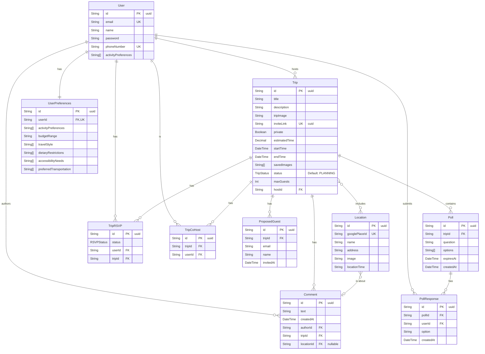

# Project Plan

**Pod Members:** Moosay Hailewold, Josh Cesar Pierre, Thomas Sibilly

## Problem Statement and Description

Planning a hangout, trip or other event can be complex, often requiring multiple apps for navigation, transport, weather, and location info. Instagram polls go unanswered, and its hard to put the cognitive effort forward to make a plan happen. Even then, people have their own preferences based on mood, dietary restrictions and more.

Our all-in-one planner, PlanIt, streamlines this by solving these problems and putting different tools together into a single, user-friendly platform. Users can select locations, filter preferences based on known constraints, and invite friends and colleagues within a few button presses.

## User Roles and Personas

### Trip Planner

#### Persona 1: "The Social Organizer"

- **Name:** Maya Singh
- **Location:** Brooklyn, New York
- **Age:** 26
- **About:** Maya is a freelance graphic designer with a vibrant social life. She's the default planner in her friend group, always organizing weekend brunches, concert outings, and spontaneous day trips.
- **Tech Savviness:** Highly tech-savvy, Maya lives on her iPhone and is comfortable using a wide variety of apps. She expects a seamless and visually appealing user interface. She would likely access the app multiple times a week.
- **Motivations:** To quickly create and share plans without jumping between apps, and to have a central hub for all her social events. She is also interested in discovering new and trendy spots.
- **Pain Points:** Information overload, lack of integration between apps, and clunky or poorly designed interfaces.

#### Persona 2: "The Family Vacation Dad"

- **Name:** David Chen
- **Location:** Suburbs of Chicago, Illinois
- **Age:** 48
- **About:** David is a high school history teacher and a father of two teenagers. He is planning the annual two-week family summer vacation road trip.

- **Tech Savviness:** Moderately tech-savvy. He primarily uses his laptop for detailed planning and his Android phone for on-the-go access. He might only use this app once or twice a year for significant trips.
- **Motivations:** To create a detailed, day-by-day itinerary, keep track of all booking confirmations in one place, and visualize the entire route and driving times.
- **Pain Points:** Overly complex apps focused on social features, hidden costs, and a steep learning curve.

### Trip Invitee

#### Persona 1: "The Busy Professional"

- **Name:** Ben Cujo
- **Location:** London, UK
- **Age:** 35
- **About:** Ben is a management consultant with a hectic travel schedule. His friends often invite him to weekend getaways and dinners.
- **Tech Savviness:** Very proficient with technology, especially on his work laptop and smartphone. He values efficiency and clarity above all else.
- **Motivations:** To get the essential details of a plan quickly, easily add the event to his work calendar, and RSVP with a single tap.
- **Pain Points:** Excessive notifications, having to hunt for key information, and being forced to create an account just to view an invitation.

#### Persona 2: "The Collaborative Student"

- **Name:** Sofia Rossi
- **Location:** Boston, Massachusetts
- **Age:** 20
- **About:** Sofia is a college student on a tight budget. She and her friends are planning a spring break trip to Montreal.
- **Tech Savviness:** Grew up with technology and is very comfortable using it, primarily on her smartphone and a school-issued laptop.
- **Motivations:** To see the proposed itinerary, suggest budget-friendly alternatives, track shared expenses transparently, and contribute ideas.
- **Pain Points:** View-only access that prevents collaboration, lack of a cost-splitting feature, and privacy concerns.

## User Stories

### **General User**

- **As a user,** I want to find this website through a landing page, so that I can understand the application's purpose and features.
- **As a user,** I want to edit my settings and profile information on a dedicated page, so I can tailor my user experience.
- **As a user,** I want to filter locations for my trip, so that I can tailor the itinerary to my specific needs.
- **As a user,** I want PlanIt to recommend locations based on my questionnaire and past trip data, so that I can discover new places I'm likely to enjoy.

### **Trip Planner**

- **As a Trip Planner,** I want to create a new trip with a name, date, and description, so that I can establish a central place for all the event's information.
- **As a Trip Planner,** I want to search for and add multiple locations to an itinerary, so that I can build a sequential and organized plan for a trip.
- **As a Trip Planner,** I want to see travel times and routes between locations, so that I can create a realistic schedule.
- **As a Trip Planner,** I want to see details like weather and operating hours for a location, so that I can plan effectively without switching apps.
- **As a Trip Planner,** I want to generate a unique, shareable link for my trip, so that I can easily invite others to view the plan and RSVP.
- **As a Trip Planner,** I want to add other users as hosts, so I can coordinate planning for large events.
- **As a Trip Planner,** I want to add proposed guests to a trip, so that I can plan for potential attendees.
- **As a Trip Planner,** I want to filter location suggestions based on guest preferences, so that I can create an itinerary that everyone will enjoy.
- **As a Trip Planner,** I want to send out rapid polls to invitees, so that I can quickly collect feedback for planning decisions.
- **As a Trip Planner,** I want to share my completed past trips with other users, so that I can provide them with inspiration or templates.
- **As a Trip Planner,** I want to use AI features, so I can get unstuck planning a trip.

### **Trip Invitee**

- **As a Trip Invitee,** I want to see the estimated duration and schedule of the trip, so that I can check my availability before responding.
- **As a Trip Invitee,** I want to RSVP to an invitation with 'Yes,' 'No,' or 'Maybe,' so that the planner knows my status.
- **As a Trip Invitee,** I want to see a list of other attendees and their RSVP status, so that I know who is coming.
- **As a Trip Invitee,** I want to add comments to the trip plan, so that I can ask questions and participate in the planning process.
- **As a Trip Invitee,** I want to add the trip to my personal calendar with one click, so that I don't forget about the event.

## Pages/Screens

- Landing Page
- Signup Page
- Login Page
- Questionnaire
- Home
- Trip Filter Page
- Trip Planner Page
- Trip Summary Page
- Profile

## Figma Rapid Prototpe & Wireframe

<iframe style="border: 1px solid rgba(0, 0, 0, 0.1);" width="800" height="450" src="https://embed.figma.com/proto/DuAlRZvorJzQUbJNyDuPzc/Capstone?node-id=2765-3&p=f&scaling=scale-down&content-scaling=fixed&page-id=0%3A1&starting-point-node-id=2765%3A3&show-proto-sidebar=1&embed-host=share" allowfullscreen></iframe>

## Data Model

Made with Mermaid via Entity Relationship diagram.

## Endpoints

These are all the **not** commented out endpoints made and planned so far.

### Health Check

- **GET** `/` - API status check

### User Management (`/api/users`)

- **GET** `/api/users` - Get all users
- **GET** `/api/users/:id` - Get user by ID
- **POST** `/api/users` - Create a new user
- **DELETE** `/api/users/:id` - Delete a user

### Trip Management (`/api/trips`)

- **GET** `/api/trips` - Get all trips
- **GET** `/api/trips/:id` - Get trip by ID
- **POST** `/api/trips` - Create a new trip
- **DELETE** `/api/trips/:id` - Delete a trip

### Location Management (`/api/locations`)

- **GET** `/api/locations` - Get all locations
- **GET** `/api/locations/:id` - Get location by ID
- **POST** `/api/locations` - Create a new location
- **DELETE** `/api/locations/:id` - Delete a location

### Comment Management (`/api/comments`)

- **GET** `/api/comments` - Get all comments
- **GET** `/api/comments/:id` - Get comment by ID
- **POST** `/api/comments` - Create a new comment
- **DELETE** `/api/comments/:id` - Delete a comment

### Trip RSVP Management (`/api/rsvps`)

- **GET** `/api/rsvps` - Get all trip RSVPs
- **GET** `/api/rsvps/:id` - Get trip RSVP by ID
- **POST** `/api/rsvps` - Create a new trip RSVP
- **DELETE** `/api/rsvps/:id` - Delete a trip RSVP

### OpenRouter AI Integration (`/api/openrouter`)

- **POST** `/api/openrouter/chat` - Generic chat completions (text and multimodal)
- **POST** `/api/openrouter/generate-text` - Simplified text generation from a prompt

### Summary of Endpoints

- HTTP Methods Used: GET, POST, DELETE
